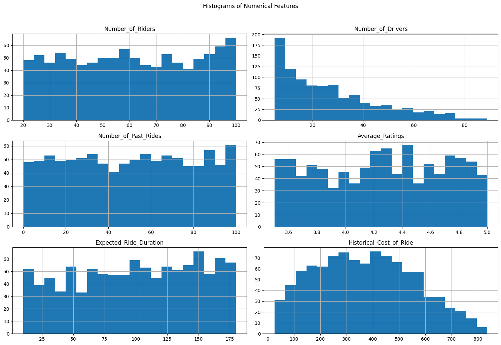

# Dynamic Pricing for Ride-Sharing - Machine Learning Project

## 🚗 Project Overview
This project builds a machine learning model to predict optimal ride fares for a ride-sharing platform using historical data. The goal is to enable dynamic pricing that balances supply, demand, and customer experience.

## 📊 Key Features
- **Data Analysis:** Explored and visualized key patterns in ride data.
- **Feature Engineering:** Identified ride duration as the most important predictor.
- **Modeling:** Built and evaluated regression models (Linear Regression, Random Forest).
- **Performance:** Achieved R² of 0.87 and low RMSE/MAE on test data.
- **Interpretability:** Used feature importance to simplify and explain the model.

## 📂 Repository Structure
- `notebooks/`: Jupyter notebook(s) with code and analysis.
- `images/`: Key visualizations (actual vss predicted plot, count plots).
- `README.md`: Project summary and instructions.

## 📝 Key Results
- **Expected ride duration** explains nearly 90% of fare variability.
- The final model is simple, accurate, and generalizes well.
- Additional features had minimal impact on performance.

## 📈 Example Visualizations

## 📚 Learning & Next Steps
- Gained hands-on experience in end-to-end ML workflow.
- Next steps: Explore real-time data and advanced models (e.g., XGBoost, deep learning).

## 📬 Contact
For questions or collaboration, reach out via [LinkedIn](https://www.linkedin.com/in/manassebastian/).

---

